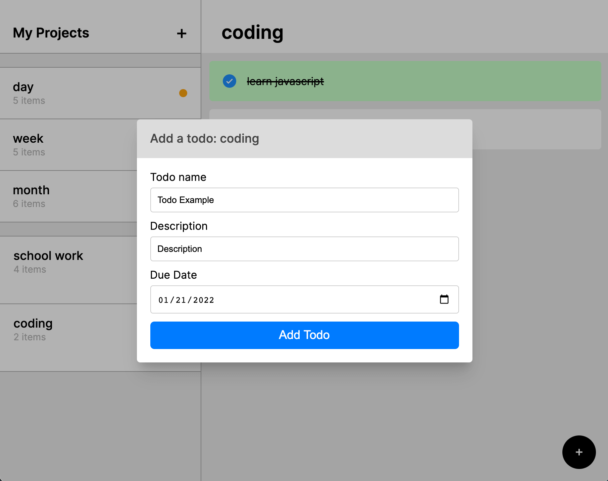

# Todo List app

This is the second project of the Javascript curriculum in Full Stack Javascript.

It allows you to add and keep track of tasks, organize them into projects, and filter them based on due date.

<br>

## Guidelines

* Each component is made using a separate module.
  * Tries to follow the Single Responsibility Principle (in SOLID)
* Pubsub is used to reduce having to tightly couple modules
* `todo.js` and `project.js` are data models
* LocalStorage is used to persist data
  * Each project takes up one key in localstorage
* Day, Week, and Month filters are present to keep track of most urgent tasks

<br>

## Screenshots
Main             |  Add Todo
:-------------------------:|:-------------------------:
  |  

<br>

## Demo

A live preview of the site can be found [here](https://tmprk.github.io/todo-list/)

<br>

## Built With

* [Javascript ES6]()
* [HTML 5]()
* [CSS 3]()

<br>

### Prerequisites

* npm
  ```sh
  npm install npm@latest -g
  ```

<br>

### Installation

1. Clone the repo
   ```sh
   git clone https://github.com/tmprk/todo-list
   ```
2. Install NPM packages
   ```sh
   npm install
   ```
3. Run webpack
   ```sh
   npm run build (to generate dist)
   npm run web (to run webpack-dev-server)
   ```

<br>

<!-- ROADMAP -->
## Roadmap

- [ ] Edit date and description of task

<br>

<!-- CONTACT -->
## Contact

Timothy P. - [@12corexeon](https://twitter.com/12corexeon) - parkimothy@gmail.com

Project Link: [https://github.com/tmprk/todo-list](https://github.com/tmprk/todo-list)

<br>

<!-- ACKNOWLEDGMENTS -->
## Acknowledgments

* [pubsub implementation](https://github.com/prof3ssorSt3v3/pubsub-demo/)
* [util to subtract dates](https://stackoverflow.com/questions/3224834/get-difference-between-2-dates-in-javascript)
